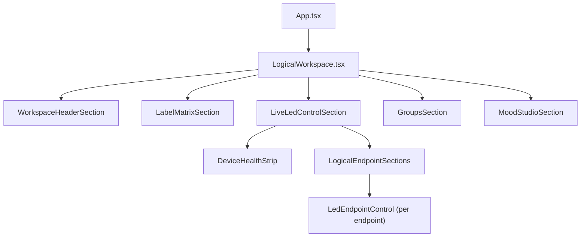
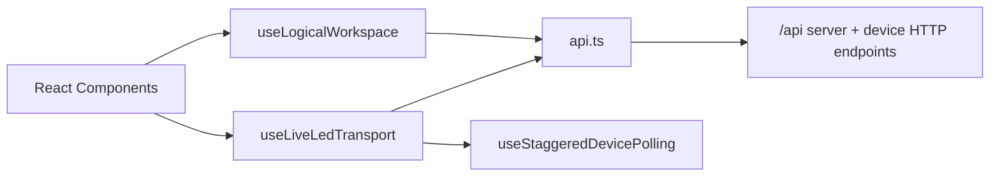
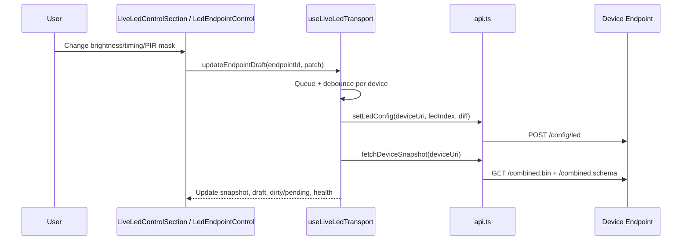
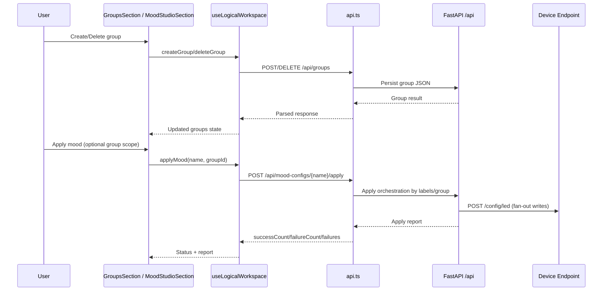

# Frontend Architecture (High-Level)

This frontend is a React + TypeScript control surface organized around two main domains:

- `logical`: labels, groups, and moods (intent model)
- `live`: real-time LED state polling + per-endpoint updates (transport model)

The top-level container is `LogicalWorkspace`, which composes these domains into one UI.

## 1) Component Layout

## 2) State and Data Boundaries

## 3) Runtime Flow (Live Control)

## 4) Runtime Flow (Logical Data + Mood Apply)

## Notes

- `useLogicalWorkspace` is the orchestration layer for discovery, labels, groups, and moods.
- `useLiveLedTransport` is the transport/state-sync layer for low-latency LED control.
- `api.ts` is the only frontend HTTP boundary and handles payload parsing/validation.
- Browser `localStorage` is no longer used for logical groups.
- Groups are persisted server-side via `/api/groups`.
- Mood apply orchestration is server-side via `/api/mood-configs/{name}/apply`.
- Live interactive per-LED writes still go directly from frontend to device endpoints for low-latency control.
